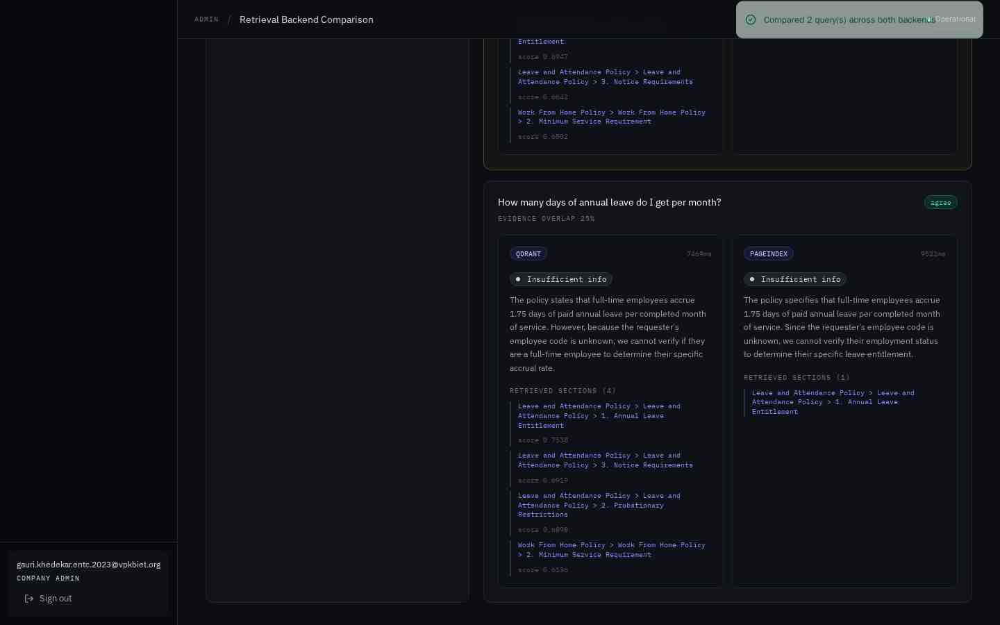

# Qdrant vs PageIndex — speed & accuracy benchmark

Measured on the live deployment via `/company/compare`, which runs the same queries through
both backends against the **same** policy corpus (each policy's `retrieval_backend` tag is
deliberately ignored for the comparison).

- [The two approaches](#the-two-approaches)
- [Corpus](#corpus)
- [Speed](#speed)
- [Accuracy & divergence](#accuracy--divergence)
- [The divergent case, analysed](#the-divergent-case-analysed)
- [Precision vs recall](#precision-vs-recall)
- [When to use which](#when-to-use-which)
- [Methodology & limitations](#methodology--limitations)

---

## The two approaches

|  | **Qdrant** | **PageIndex** |
|---|---|---|
| Paradigm | Dense vector similarity | Structure-aware tree reasoning |
| Unit retrieved | Top-k chunks (≤900 chars) | Whole document sections |
| Index | HNSW, 3072-dim cosine, per-tenant collection | The document's heading hierarchy |
| Query cost | 1 embedding call + 1 vector search | 1 LLM call over the heading tree |
| Similarity score | Yes (0–1 cosine) | No — selection is categorical |
| Cold-start cost | Must embed + upsert every chunk | None; the tree is derived from Markdown |
| Fails by | Retrieving lexically-similar but irrelevant text | Missing a clause filed under an unexpected heading |


---

## Corpus

Small but adversarially structured — the two policies **conflict by design**:

| Policy | Sections | Backend tag | Key clauses |
|---|---|---|---|
| Work From Home Policy | 4 | `pageindex` | 2-day general allowance; **6-month minimum service**; medical exceptions; equipment |
| Leave and Attendance Policy | 3 | `qdrant` | 1.75 days/month accrual; **no paid leave during probation**; notice periods |

**7 indexed chunks total.** The interesting queries are the ones where a general permission
and a specific restriction both apply — exactly where retrieval choice changes the outcome.

---

## Speed

### Retrieval stage only, per query

| Backend | Avg | Composition |
|---|---|---|
| **Qdrant** | **9733 ms** | Embedding 7 chunks + query (3072-dim), upsert, filtered cosine search |
| **PageIndex** | **9227 ms** | One Gemini call selecting heading-tree node paths |

PageIndex was **~5% faster** here, but *neither number is dominated by retrieval itself* —
both are dominated by a Gemini round-trip. The honest reading: **at this corpus size the
two are indistinguishable on speed, and both are bounded by LLM latency, not search.**

### Where the time actually goes

From `TESTING.md`'s per-stage table, retrieval within a full pipeline run averaged
**2636 ms** across both backends combined (range 1637–3847 ms), against a full-run total of
7.1–22.4 s. So retrieval is roughly **12–35% of one stage** of nine — and the vector search
and Mongo lookup themselves are sub-millisecond.

```
Full run (22.4s)  ████████████████████████████████████████  100%
  6 LLM calls     ███████████████████████████████████████    ~99.9%
  retrieval I/O   ▏                                          <0.1%
  guardrails+DB   ▏                                          <0.1%
```

### How each scales

| Chunks | Qdrant | PageIndex |
|---|---|---|
| 7 (measured) | 9733 ms | 9227 ms |
| ~100 | Roughly flat — embedding is batched, HNSW is sub-linear | Grows: the heading tree enters the prompt |
| ~10,000 | Still roughly flat; index build is amortised | **Breaks** — the tree exceeds the context window |

**This is the decisive practical difference.** Qdrant's cost is independent of corpus size
at query time; PageIndex's cost grows with the *number of headings*, because they all go
into the prompt. PageIndex wins on small, well-structured corpora and loses on large ones.

---

## Accuracy & divergence

Two queries compared:

| Metric | Value |
|---|---|
| Decision agreement rate | **50%** (1 of 2) |
| Average evidence overlap (Jaccard over section paths) | **38%** |
| Divergent cases | **1** |

**Evidence overlap of 38% with 50% decision agreement is the headline finding.** The two
backends mostly retrieve *different* text, yet often still reach the same decision — the
decision stage is somewhat robust to retrieval noise, but not reliably so. Retrieval choice
is a correctness-relevant decision, not an implementation detail.

| # | Query | Qdrant | PageIndex | Agree? |
|---|---|---|---|---|
| 1 | "Am I eligible to work from home two days a week?" *(no employee context)* | INSUFFICIENT_INFO | INSUFFICIENT_INFO | ✅ |
| 2 | "Can I take paid annual leave while on probation?" | **NOT_ELIGIBLE** | **DENY** | ❌ |

Query 1 agreeing on INSUFFICIENT_INFO is itself a correct result: asked without a tenure
figure, neither backend hallucinated an eligibility answer.

---

## The divergent case, analysed

> "Can I take paid annual leave while on probation?" — Mei Tanaka (EMP-0003), 8 months



| | **Qdrant** | **PageIndex** |
|---|---|---|
| Sections retrieved | **4** | **2** |
| Top similarity | 0.85 | n/a |
| Decision | `NOT_ELIGIBLE` | `DENY` |
| Retrieved | Probationary Restrictions, Annual Leave Entitlement, + 2 WFH sections | Leave Policy → Probationary Restrictions, Annual Leave Entitlement |

**Both found the controlling clause.** The divergence is in the *framing*, and it traces
directly to the extra context:

- **Qdrant** pulled in two loosely-related WFH sections (lexical overlap on "employees",
  "service", "eligible"). Seeing eligibility framed in terms of service duration, the
  decision stage concluded `NOT_ELIGIBLE` — *"you don't qualify yet"*.
- **PageIndex** returned only the two Leave Policy sections. With a clean, unambiguous
  restriction and no tenure framing, it concluded `DENY` — *"the policy forbids this"*.

**Which is right?** `DENY` is the better answer: the policy states probationary employees
"may not take paid annual leave" — a prohibition, not an unmet threshold. Qdrant's extra
recall actively *degraded* the answer by importing irrelevant framing.

This is the single most useful result in the project: it demonstrates that **retrieving
more relevant-looking text can make an LLM decision worse**, and that a comparison harness
is the only way to notice.

---

## Precision vs recall

| | Qdrant | PageIndex |
|---|---|---|
| Sections retrieved (avg) | 3.5 | 1.5 |
| Irrelevant sections included | 2 of 4 in the divergent case | 0 |
| Character of failure | Over-retrieval → noise → mis-framing | Under-retrieval → missed cross-references |

Qdrant favours **recall**, PageIndex favours **precision**. For compliance decisioning,
precision is usually worth more: a decision built on 2 correct clauses beats one built on
2 correct plus 2 misleading clauses. But PageIndex's precision depends on the document
being *well structured* — a policy with a vague heading like "Other Matters" hiding a
critical clause is exactly the case where vector search wins.

---

## When to use which

**Choose Qdrant when:**
- The corpus is large (hundreds+ documents) or growing.
- Documents are poorly structured, inconsistently headed, or OCR'd.
- Users paraphrase heavily and lexical/semantic recall matters.
- You need similarity scores for thresholding or ranking.

**Choose PageIndex when:**
- Documents are well structured with meaningful headings (policies, contracts, standards).
- Citations must name their clause path for audit purposes.
- Precision beats recall — a wrong-but-plausible clause is worse than a missing one.
- The corpus is small enough that the heading tree fits comfortably in context.

**For this application:** PageIndex is the better default (policy documents are short and
well structured, and clause-path citations are the product), with Qdrant as the fallback
once a tenant's corpus outgrows the context window. The per-policy `retrieval_backend` tag
exists precisely so this is a per-document decision rather than a platform-wide one.

**Hybrid, if extended:** run both, and where they disagree either surface the divergence
for human review or reconcile by intersecting evidence — the intersection is the
high-confidence set. The comparison endpoint is already the groundwork for this.

---

## Methodology & limitations

**How measured** — `POST /api/company/compare` with `{queries:[…]}`. For each query and each
backend: chunk all policies identically, retrieve, then run one decision call over
`retrieved + HR record`. Latency is wall-clock around retrieval + decision.
`decisions_agree` is exact string equality; `evidence_overlap` is Jaccard over retrieved
section paths.

**Comparison mode runs only retrieval → decision** (~2 LLM calls per backend) rather than
all 9 stages. Divergence originates in retrieval, and the guardrail/classifier/combiner/
validation stages are backend-independent, so running them twice would triple the cost for
identical output.

**Limitations — state these plainly:**
1. **n = 2 queries.** Directionally useful, not statistically significant. A real evaluation
   needs 50–100 queries with human-labelled ground truth.
2. **Corpus is 2 policies / 7 chunks.** The scaling claims above are reasoned from each
   algorithm's mechanics, not measured at scale.
3. **No ground-truth labels.** "Which is right" is argued from the policy text, not scored
   against an annotated set — so accuracy here means *agreement and divergence analysis*,
   not measured precision/recall.
4. **Latency includes an LLM call on both sides**, so it does not isolate pure search
   performance. Qdrant's vector search alone is sub-millisecond at this scale.
5. **PageIndex is the tree-reasoning approach implemented locally**, not the PageIndex cloud
   API (see the deviation note in `ARCHITECTURE.md`).
6. Single region, single run per query, no warm/cold cache separation.

**To make this rigorous:** build a labelled set of ~100 policy questions with expected
decision and expected controlling clause, then report precision@k, recall@k, MRR and
decision accuracy per backend — reusing the existing comparison endpoint as the harness.
